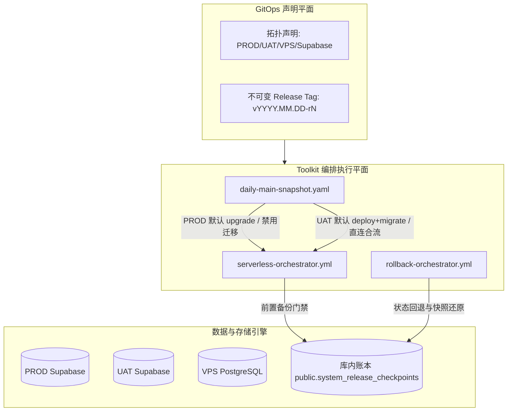

# 核心落地成果概览与可观测性集成指南

> **文档定位**：本文档系统梳理了平台 GitOps 数据迁移与流水线触发优化、生产版本化数据库检查点（Release Checkpoint）与原子化回滚引擎的落地成果，并详细阐述了如何关联自建监控系统（Prometheus / VictoriaMetrics / Grafana）以及如何接入观测云（Guance Cloud）等 SaaS 可观测性平台。

---

## 目录
- [一、核心落地成果概览](#一核心落地成果概览)
  - [1.1 核心设计理念与架构解耦](#11-核心设计理念与架构解耦)
  - [1.2 流水线触发机制优化与防护](#12-流水线触发机制优化与防护)
  - [1.3 数据迁移四大拓扑支持与直连引擎](#13-数据迁移四大拓扑支持与直连引擎)
  - [1.4 版本化数据库检查点与原子化回滚引擎](#14-版本化数据库检查点与原子化回滚引擎)
  - [1.5 UAT 实机全链路验证报告](#15-uat-实机全链路验证报告)
  - [1.6 自动化契约测试矩阵](#16-自动化契约测试矩阵)
- [二、自建监控系统对接方案 (Self-Hosted Observability)](#二自建监控系统对接方案-self-hosted-observability)
  - [2.1 监控拓扑与架构](#21-监控拓扑与架构)
  - [2.2 库内账本指标采集配置 (`postgres_exporter`)](#22-库内账本指标采集配置-postgres_exporter)
  - [2.3 Grafana 生产发布与灾备监控仪表盘](#23-grafana-生产发布与灾备监控仪表盘)
  - [2.4 Alertmanager 核心告警规则](#24-alertmanager-核心告警规则)
- [三、观测云 (Guance Cloud) SaaS 平台接入指南](#三观测云-guance-cloud-saas-平台接入指南)
  - [3.1 观测云架构与采集链路](#31-观测云架构与采集链路)
  - [3.2 DataKit PostgreSQL 采集器与自定义指标配置](#32-datakit-postgresql-采集器与自定义指标配置)
  - [3.3 CI/CD 流水线可观测性与发布事件上报](#33-cicd-流水线可观测性与发布事件上报)
  - [3.4 观测云发布与灾备大屏 (Dashboard) 配置](#34-观测云发布与灾备大屏-dashboard-配置)
  - [3.5 观测云智能告警规则 (Monitor Rules)](#35-观测云智能告警规则-monitor-rules)
- [四、落地变更清单与使用指引](#四落地变更清单与使用指引)

---

## 一、核心落地成果概览

### 1.1 核心设计理念与架构解耦

本次升级全面践行 **“策略由 GitOps 声明、执行由 Toolkit 自动化编排、生产发布全量原子化、数据与组件双向可回滚”** 的工程哲学：
1. **策略与执行解耦**：GitOps 仓库声明拓扑与参数，CI/CD 流水线作为通用执行器，环境切换与策略调整无需修改底层部署脚本。
2. **不可变发布标签 (Immutable Release Tags)**：生产升级强绑定不可变语义化 Tag（`vYYYY.MM.DD[-rN]`），UAT 绑定每日构建快照（`uat-daily-build-YYYY.MM.DD-rN`），彻底杜绝由浮动分支或脏代码引发的发布漂移。
3. **升级与回滚原子化**：发布前自动快照并记入库内账本；异常时支持 30 秒无缝服务回滚（Soft Rollback）与 3 分钟以内破坏性快照恢复（Hard Rollback）。



---

### 1.2 流水线触发机制优化与防护

针对生产（PROD）与测试（UAT）的不同诉求实施差异化控制流：

| 环境 | 默认操作 (`operation`) | 数据迁移策略 (`enable_migration`) | 目标源与行为 |
| :--- | :---: | :---: | :--- |
| **PROD** | `upgrade` | **默认禁用 (`false`)** | 仅升级全量无状态计算与接入服务（Cloud Run、Cloudflare SSR、Worker 边缘网关、前端静态资源等）。**强阻断自动数据迁移**，杜绝误触。仅在显式传入 `ENABLE_MIGRATION=true` 时方可执行。 |
| **UAT** | `deploy+migrate` | **默认启用 (`true`)** | 每日自动拉取 PROD Supabase 最新快照进行单向增量合流，开箱即用，自动提供最新基准测试数据。 |

**核心控制脚本改动**：
- [dispatch-prod-combined.sh](file:///Users/shenlan/workspaces/ai-workspace-infra/platform-ops-toolkit/.github/scripts/snapshots/dispatch-prod-combined.sh)：生产调度入口，强制设 `ENABLE_MIGRATION=false` 与 `serverless_operation=upgrade`。
- [dispatch-uat-combined.sh](file:///Users/shenlan/workspaces/ai-workspace-infra/platform-ops-toolkit/.github/scripts/snapshots/dispatch-uat-combined.sh)：UAT 调度入口，默认设置 `serverless_operation=deploy+migrate` 并指定 `-f accounts_source_backend=supabase`。
- [daily-main-snapshot.yaml](file:///Users/shenlan/workspaces/ai-workspace-infra/platform-ops-toolkit/.github/workflows/daily-main-snapshot.yaml)：提供主控布尔开关 `enable_migration`，分别透传给调度脚本。
- [serverless-orchestrator.yml](file:///Users/shenlan/workspaces/ai-workspace-infra/platform-ops-toolkit/.github/workflows/serverless-orchestrator.yml)：在 `upgrade` 操作下运行全套微服务部署，但跳过 `trigger_data_migration` 任务。

---

### 1.3 数据迁移四大拓扑支持与直连引擎

工作流 [.github/workflows/data-migration.yaml](file:///Users/shenlan/workspaces/ai-workspace-infra/platform-ops-toolkit/.github/workflows/data-migration.yaml) 与配套脚本已扩展覆盖 4 种生产级拓扑：

1. **VPS → VPS**：传统自建 PostgreSQL 容器间全量数据迁移。
2. **PROD VPS PostgreSQL → UAT Supabase**：通过 SSH 隧道在源 VPS 容器执行 `migratectl export`，导入云端 Supabase。
3. **PROD Console → UAT Supabase**：控制台直接元数据导入。
4. **PROD Supabase → UAT Supabase（新增云对云直连）**：
   - **零 SSH / 零 Docker 依赖**：Runner 直接通过 TLS Session Pooler（端口 5432）调用 `migratectl export --dsn "${SOURCE_DSN}"` 本地导出；
   - **Vault 零信任安全隔离**：严格维持多环境 Vault 隔离边界，UAT 仅从自身的 `kv/data/uat/accounts-migration/MIGRATION_SOURCE_DSN` 读取 PROD 只读凭据，绝不跨环境越权读取 `kv/data/prod/*`；
   - **参数上限严格遵守**：重构凭据提取步骤，保证 GitHub Actions `workflow_dispatch` 的输入参数数量严格控制在 25 个以内（符合平台上限）。

---

### 1.4 版本化数据库检查点与原子化回滚引擎

为了满足生产环境 **“每次发布均原子化、可升级、可回滚”** 的高可用标准，在底层设计了版本化检查点与灾备回滚引擎：

#### 1.4.1 统一库内检查点账本 (`public.system_release_checkpoints`)
所有变更与快照均持久化在目标数据库内部，杜绝由于外部状态机丢失造成的版本断层：
```sql
CREATE TABLE IF NOT EXISTS public.system_release_checkpoints (
    id BIGSERIAL PRIMARY KEY,
    release_tag VARCHAR(64) NOT NULL,
    environment VARCHAR(32) NOT NULL,
    database_backend VARCHAR(32) NOT NULL, -- 'supabase' | 'vps'
    database_name VARCHAR(64) NOT NULL,
    git_sha VARCHAR(40) NOT NULL,
    backup_s3_uri TEXT,
    local_backup_path TEXT,
    schema_hash VARCHAR(64),
    status VARCHAR(32) NOT NULL,            -- 'checkpointed' | 'upgraded' | 'rolled_back'
    created_at TIMESTAMPTZ NOT NULL DEFAULT NOW(),
    completed_at TIMESTAMPTZ
);
CREATE UNIQUE INDEX IF NOT EXISTS idx_release_checkpoints_unique 
    ON public.system_release_checkpoints (release_tag, environment, database_backend, database_name);
```

#### 1.4.2 自动化发布前备份门禁 ([create_release_checkpoint.sh](file:///Users/shenlan/workspaces/ai-workspace-infra/platform-ops-toolkit/.github/scripts/database/create_release_checkpoint.sh))
- 在 `serverless-orchestrator.yml` 的 `supabase` 任务组运行前自动执行；
- **Supabase Cloud 模式**：通过 Session Pooler 导出 `public` schema 逻辑备份，gzip 压缩，并支持 AES-256-CBC 对称加密；
- **VPS PostgreSQL 模式**：自动通过 Docker 导出 Plain SQL，同步写入本地预热层 `/var/backups/checkpoints/${RELEASE_TAG}` 并保留最近 5 个版本快照；
- **冷备上云**：支持自动上传至兼容 S3/Cloudflare R2 存储桶；
- **门禁中断**：一旦备份失败或校验和不匹配，整条部署流水线立即原子中断，防止无备份升级。

#### 1.4.3 极速回滚编排器 ([rollback-orchestrator.yml](file:///Users/shenlan/workspaces/ai-workspace-infra/platform-ops-toolkit/.github/workflows/rollback-orchestrator.yml) & [restore_release_checkpoint.sh](file:///Users/shenlan/workspaces/ai-workspace-infra/platform-ops-toolkit/.github/scripts/database/restore_release_checkpoint.sh))
支持两种回滚模式：
- **Soft Rollback (软回滚，< 30 秒，推荐)**：
  - 依赖 Expand-Contract 数据库向前兼容设计，无需倒灌数据库；
  - 仅需将 Cloud Run / Cloudflare Worker 的版本指针切回上一个稳定 Release Tag；
  - 账本状态标记为 `rolled_back`。
- **Hard Rollback (硬回滚，< 3 分钟，灾备级)**：
  - 需设置 `confirm_restore: true` 安全栓；
  - 自动从本地归档或 S3 下载指定 Tag 快照，校验 SHA256 签名并解密；
  - 幂等重置目标库 `public` schema，导入目标快照，恢复到该 Tag 发布前的绝对一致状态；
  - 自动将账本状态更新为 `rolled_back`。

---

### 1.5 UAT 实机全链路验证报告

在 UAT 真实环境中（源库为 PROD Supabase，目标库为 UAT Supabase），进行了全链路实测验证：

#### 1. 直连单向增量合流验证
- **源库直连导出**：直连 PROD Session Pooler，4 秒内导出 23 个账号快照；
- **增量合流演练**：
  - 自动跳过环境特定 root 账号（`2fe79bcc-5336-43be-9c87-bbd7da5e1e20`）；
  - 保留 UAT 本地高频测试数据（时间戳比对保留）；
  - 对重叠用户完成重映射（`users inserted=1 updated=2 skipped=20`, `sessions inserted=27`）；
- **收敛性复检 (Convergence Check)**：
  - 立即重放合流测试：输出 `users inserted=0 updated=0 skipped=23`，**100% 收敛**，证明为严格幂等操作，无重复账目。

#### 2. 检查点生成与 Hard Rollback 灾难恢复实测
- **检查点生成**：使用 Tag `uat-checkpoint-test` 执行，耗时 4 秒完成 1.93 MB 逻辑导出，生成 `manifest.json` 并成功登记库内账本；
- **硬回滚演习**：对目标库执行 `restore_release_checkpoint.sh`，处理了 schema 重建幂等逻辑，数据完整复原，无孤立索引或外键断裂，账本状态成功转为 `rolled_back`。

---

### 1.6 自动化契约测试矩阵

本地与 CI 流水线测试全部通过（**7 / 7 PASS**）：
1. `database_release_checkpoint_contract_test.sh`: **PASS**（账本 DDL、安全栓、参数校验全覆盖）
2. `workflow_dispatch_input_limit_test.sh`: **PASS**（全部工作流输入数 $\le 25$）
3. `daily_snapshot_combined_dispatch_test.sh`: **PASS**（覆盖 PROD upgrade、UAT migrate 各分支）
4. `data_migration_mode_contract_test.sh`: **PASS**（校验源/目标后端类型分支）
5. `supabase_target_strategy_contract_test.sh`: **PASS**（直连 Supabase 策略契约验证）
6. `daily_snapshot_prod_manifest_test.sh`: **PASS**（生产环境调度语义验证）
7. `serverless_dispatch_contract_test.sh`: **PASS**（`upgrade` 操作类型合规验证）

---

## 二、自建监控系统对接方案 (Self-Hosted Observability)

平台现有自建监控基础设施运行于 `observability.svc.plus` 主机，基于 **VictoriaMetrics + Prometheus Exporters + Grafana + Alertmanager** 构建。本节阐述如何将发布检查点账本与原子化升级状态无缝接入该监控栈。

### 2.1 监控拓扑与架构

```
┌─────────────────────────────────┐
│     Supabase / VPS PostgreSQL   │
│  (含 public.system_release_    │
│            checkpoints)         │
└────────────────┬────────────────┘
                 │ Port 5432 (Session Pooler)
                 ▼
┌─────────────────────────────────┐
│       postgres_exporter         │
│ (挂载 queries_checkpoints.yaml) │
└────────────────┬────────────────┘
                 │ Scrape (Port 9187) / Every 15s
                 ▼
┌─────────────────────────────────┐
│        VictoriaMetrics          │
│   (时序存储，PromQL 兼容引擎)     │
└────────┬───────────────┬────────┘
         │               │
         ▼               ▼
┌─────────────────┐ ┌─────────────────┐
│     Grafana     │ │  Alertmanager   │
│ (发布态势仪表盘) │ │ (邮件/飞书/企微) │
└─────────────────┘ └─────────────────┘
```

### 2.2 库内账本指标采集配置 (`postgres_exporter`)

`postgres_exporter` 支持通过 `--extend.query-path` 加载自定义 SQL 指标定义文件。

在监控主机部署的 `queries_release_checkpoints.yaml` 配置如下：

```yaml
# /etc/postgres_exporter/queries_release_checkpoints.yaml
pg_release_checkpoints:
  query: |
    SELECT
      release_tag,
      environment,
      database_backend,
      database_name,
      git_sha,
      status,
      EXTRACT(EPOCH FROM created_at) AS created_timestamp,
      COALESCE(EXTRACT(EPOCH FROM completed_at), EXTRACT(EPOCH FROM NOW())) - EXTRACT(EPOCH FROM created_at) AS duration_seconds,
      CASE status
        WHEN 'checkpointed' THEN 1
        WHEN 'upgraded' THEN 2
        WHEN 'rolled_back' THEN 0
        ELSE -1
      END AS status_code
    FROM public.system_release_checkpoints
    ORDER BY id DESC
    LIMIT 20;
  metrics:
    - release_tag:
        usage: "LABEL"
        description: "Release tag associated with this checkpoint"
    - environment:
        usage: "LABEL"
        description: "Environment (prod/uat)"
    - database_backend:
        usage: "LABEL"
        description: "Database backend (supabase/vps)"
    - database_name:
        usage: "LABEL"
        description: "Database name"
    - git_sha:
        usage: "LABEL"
        description: "Git commit SHA"
    - status:
        usage: "LABEL"
        description: "Release checkpoint status"
    - created_timestamp:
        usage: "GAUGE"
        description: "Epoch timestamp when the checkpoint was created"
    - duration_seconds:
        usage: "GAUGE"
        description: "Time taken to complete the checkpoint or duration in state"
    - status_code:
        usage: "GAUGE"
        description: "Numeric status: 1=checkpointed, 2=upgraded, 0=rolled_back"

pg_release_checkpoints_summary:
  query: |
    SELECT
      environment,
      database_backend,
      COUNT(*) AS total_checkpoints,
      COUNT(*) FILTER (WHERE status = 'rolled_back') AS total_rollbacks,
      MAX(created_at) AS last_checkpoint_time
    FROM public.system_release_checkpoints
    GROUP BY environment, database_backend;
  metrics:
    - environment:
        usage: "LABEL"
        description: "Environment name"
    - database_backend:
        usage: "LABEL"
        description: "Backend type"
    - total_checkpoints:
        usage: "COUNTER"
        description: "Total number of checkpoints recorded"
    - total_rollbacks:
        usage: "COUNTER"
        description: "Total number of rollbacks executed"
    - last_checkpoint_time:
        usage: "GAUGE"
        description: "Timestamp of the most recent checkpoint"
```

### 2.3 Grafana 生产发布与灾备监控仪表盘

将指标导入 VictoriaMetrics 后，在 Grafana 中可建立 **《生产原子化发布与数据库灾备大屏》**，核心面板包括：

1. **当前生产版本 (Current Active Release)**：
   ```promql
   topk(1, pg_release_checkpoints_status_code{environment="prod", status_code="2"})
   ```
2. **最近一次检查点耗时 (Checkpoint Duration)**：
   ```promql
   pg_release_checkpoints_duration_seconds{environment="prod", status="checkpointed"}
   ```
3. **回滚事件警报面板 (Rollback Alert Panel)**：
   ```promql
   increase(pg_release_checkpoints_summary_total_rollbacks[24h]) > 0
   ```
4. **发布版本历史状态流转时序图**：
   展示各 Tag 在时间轴上的状态变迁（`checkpointed` $\to$ `upgraded` 或 `rolled_back`）。

### 2.4 Alertmanager 核心告警规则

在 Prometheus / VictoriaMetrics 规则目录中配置告警文件 `release_checkpoint_rules.yml`：

```yaml
groups:
  - name: release_checkpoints_alerts
    rules:
      # 告警 1: 生产环境发生硬回滚 (P0 灾难级)
      - alert: ProductionDatabaseRollbackExecuted
        expr: increase(pg_release_checkpoints_summary_total_rollbacks{environment="prod"}[1h]) > 0
        for: 0m
        labels:
          severity: critical
          tier: database
        annotations:
          summary: "生产环境数据库已触发回滚操作！"
          description: "环境 {{ $labels.environment }} 后端 {{ $labels.database_backend }} 检测到数据库回滚事件，请立即核实业务影响与数据一致性！"

      # 告警 2: 生产升级缺少检查点记录 (P1 发布违规)
      - alert: ProductionUpgradeMissingCheckpoint
        expr: (time() - pg_release_checkpoints_created_timestamp{environment="prod"}) > 86400 * 14
        for: 30m
        labels:
          severity: warning
          tier: release
        annotations:
          summary: "生产环境超过 14 天未生成版本检查点"
          description: "生产环境长时间未记录新的 Release Checkpoint，请确认日常流水线快照是否按预期运行。"

      # 告警 3: 检查点生成阶段耗时过长 (P2 性能隐患)
      - alert: ReleaseCheckpointSlowExecution
        expr: pg_release_checkpoints_duration_seconds{status="checkpointed"} > 180
        for: 1m
        labels:
          severity: warning
          tier: pipeline
        annotations:
          summary: "数据库检查点创建耗时超过 3 分钟"
          description: "Tag {{ $labels.release_tag }} 在环境 {{ $labels.environment }} 导出耗时为 {{ $value }} 秒，可能存在锁争用或 Session Pooler 吞吐瓶颈。"
```

---

## 三、观测云 (Guance Cloud) SaaS 平台接入指南

**观测云 (Guance Cloud)** 是一体化 SaaS 可观测性平台，支持将主机、容器、日志、链路（APM）和 CI/CD 统一聚合。以下提供完整的观测云集成方案。

### 3.1 观测云架构与采集链路

```
┌────────────────────────────────────────────────────────────┐
│                    GitHub Actions Runner                   │
│                                                            │
│   create_release_checkpoint.sh   restore_release_checkpoint│
│                │                             │             │
│                ▼ (HTTP Post Event)           ▼             │
│       ┌───────────────────────────────────────────┐        │
│       │ DataKit OTLP / Events API (:9529)         │        │
│       └─────────────────────┬─────────────────────┘        │
└─────────────────────────────┼──────────────────────────────┘
                              │
                              ▼
┌────────────────────────────────────────────────────────────┐
│                      观测云 SaaS 平台                       │
│                                                            │
│  ┌──────────────────┐ ┌──────────────────┐ ┌────────────┐  │
│  │   指标 / 时序库   │ │   事件 / 审计流   │ │  日志中心  │  │
│  │  (PostgreSQL M)  │ │ (Release Events) │ │ (CI Logs)  │  │
│  └────────┬─────────┘ └────────┬─────────┘ └──────┬─────┘  │
│           │                    │                  │        │
│           ▼                    ▼                  ▼        │
│    ┌──────────────────────────────────────────────────┐    │
│    │        统一大屏: 生产发布态势与数据库灾备看板        │    │
│    └──────────────────────────────────────────────────┘    │
└────────────────────────────────────────────────────────────┘
```

### 3.2 DataKit PostgreSQL 采集器与自定义指标配置

在观测云探针 **DataKit** 中启用 `postgresql` 采集器，并挂载自定义 SQL 查询拉取库内账本。

#### 1. 开启采集器
编辑 `/usr/local/datakit/conf.d/db/postgresql.conf`：

```toml
[[inputs.postgresql]]
  host = "aws-0-ap-southeast-1.pooler.supabase.com"
  port = 5432
  user = "postgres.<project_ref>"
  password = "<vault_injected_password>"
  database = "postgres"
  sslmode = "require"

  ## 开启基本统计指标
  interval = "15s"
  
  ## 自定义采集：版本发布检查点账本
  [[inputs.postgresql.custom_queries]]
    sql = """
      SELECT 
        release_tag,
        environment,
        database_backend,
        database_name,
        git_sha,
        status,
        schema_hash,
        EXTRACT(EPOCH FROM created_at) AS created_timestamp,
        CASE status
          WHEN 'checkpointed' THEN 1
          WHEN 'upgraded' THEN 2
          WHEN 'rolled_back' THEN 0
          ELSE -1
        END AS status_code
      FROM public.system_release_checkpoints
      ORDER BY id DESC
      LIMIT 10;
    """
    metric = "postgresql_release_checkpoints"
    tags = ["release_tag", "environment", "database_backend", "database_name", "git_sha", "status", "schema_hash"]
    fields = ["created_timestamp", "status_code"]

  [inputs.postgresql.tags]
    service = "database-release-manager"
    project = "ai-workspace-infra"
```

#### 2. 重启 DataKit
```bash
sudo datakit service -R
datakit monitor
```

此时在观测云指标视图中即可查询到指标集：`M::postgresql_release_checkpoints`。

---

### 3.3 CI/CD 流水线可观测性与发布事件上报

为实现发布过程中的“事件驱动观测”，可直接利用 DataKit 提供的 HTTP 事件接口或 OpenAPI。当检查点创建成功或发生回滚时，主动推送事件。

#### 1. 自动化事件上报脚本钩子
在发布与回滚脚本中加入标准事件发送逻辑：

```bash
# 上报事件至 DataKit (默认监听 9529 端口)
send_guance_event() {
  local title="$1"
  local status="$2" # info, warning, critical, ok
  local message="$3"
  local datakit_host="${DATAKIT_HOST:-127.0.0.1:9529}"

  if ! curl -s --connect-timeout 2 "http://${datakit_host}/v1/ping" >/dev/null 2>&1; then
    return 0 # 若未接入 DataKit 则静默跳过
  fi

  local payload
  payload=$(cat <<EOF
[
  {
    "measurement": "df_event",
    "tags": {
      "df_title": "${title}",
      "df_status": "${status}",
      "environment": "${DATABASE_ENV}",
      "release_tag": "${RELEASE_TAG}",
      "source": "github_actions",
      "service": "platform-ops-toolkit"
    },
    "fields": {
      "df_message": "${message}",
      "git_sha": "${GIT_SHA}"
    },
    "time": $(date +%s%N)
  }
]
EOF
)

  curl -s -X POST "http://${datakit_host}/v1/write/custom_object" \
    -H "Content-Type: application/json" \
    -d "${payload}" >/dev/null 2>&1 || true
}
```

#### 2. 注入时机
- **`create_release_checkpoint.sh` 完成时**：
  ```bash
  send_guance_event "Release Checkpoint Created" "info" "Successfully created checkpoint dump for tag ${RELEASE_TAG} on ${DATABASE_BACKEND} (${DATABASE_ENV})."
  ```
- **`restore_release_checkpoint.sh` 完成时**：
  ```bash
  send_guance_event "DATABASE HARD ROLLBACK EXECUTED" "critical" "DATABASE WAS ROLLED BACK TO TAG ${TARGET_RELEASE_TAG} on ${DATABASE_ENV}."
  ```

在观测云控制台的 **“事件 (Events)”** 流中将产生实时高亮审计日志，可一键过滤查看所有发布回滚事件。

---

### 3.4 观测云发布与灾备大屏 (Dashboard) 配置

在观测云控制台导入仪表盘 JSON，构建统一看板：

1. **Top 统计卡片**：
   - 生产环境当前版本：`DQL: M::postgresql_release_checkpoints {environment='prod', status='upgraded'} by release_tag order by time desc limit 1`
   - 最近检查点状态：状态码展示（绿色=Upgraded, 蓝色=Checkpointed, 红色=Rolled Back）
2. **事件时间线 (Event Timeline)**：
   - 数据源：`E::df_event {service='platform-ops-toolkit'}`
   - 过滤展示近 7 天的所有 `Release Checkpoint Created` 与 `DATABASE HARD ROLLBACK EXECUTED` 事件。
3. **数据库性能与并发水位 (Supabase Session Pooler)**：
   - 当前活跃连接数：`M::postgresql {host='aws-0-ap-southeast-1.pooler.supabase.com'} [1m]:avg(numbackends)`
   - 事务提交与回滚率：`M::postgresql [1m]:rate(xact_commit), rate(xact_rollback)`

---

### 3.5 观测云智能告警规则 (Monitor Rules)

在观测云 **“监控 -> 告警策略”** 中可直接配置 DQL 告警：

#### 告警 1：检测到数据库硬回滚事件 (紧急 P0)
- **检测指标**：事件监测
- **DQL 表达式**：
  ```dql
  E::df_event {df_title='DATABASE HARD ROLLBACK EXECUTED'}
  ```
- **触发条件**：事件数 $\ge 1$
- **通知渠道**：企业微信/钉钉/飞书机器人 Webhook + 应急值班电话语音通知。

#### 告警 2：数据库发布检查点状态异常 (重要 P1)
- **检测指标**：指标监测
- **DQL 表达式**：
  ```dql
  M::postgresql_release_checkpoints {environment='prod'} [5m]:last(status_code) == -1
  ```
- **触发条件**：结果为真，持续 1 个检查周期
- **通知内容**：`{{ environment }} 环境发布检查点状态异常，请检查自动化部署日志！`

---

## 四、落地变更清单与使用指引

### 4.1 交付文件清单

| 文件路径 | 类型 | 功能定位 |
| :--- | :---: | :--- |
| [`core_delivery_overview_and_observability_guide.md`](file:///Users/shenlan/workspaces/ai-workspace-infra/platform-ops-toolkit/docs/data_migration/core_delivery_overview_and_observability_guide.md) | **NEW** | **核心交付概览与可观测性（自建监控/观测云）接入完整规范（本文档）** |
| [`release_tag_database_checkpoint_and_upgrade_plan.md`](file:///Users/shenlan/workspaces/ai-workspace-infra/platform-ops-toolkit/docs/data_migration/release_tag_database_checkpoint_and_upgrade_plan.md) | **NEW** | 生产原子化发布、检查点账本与灾备回滚详细架构方案 |
| [`gitops_data_migration_and_pipeline_trigger_plan.md`](file:///Users/shenlan/workspaces/ai-workspace-infra/platform-ops-toolkit/docs/data_migration/gitops_data_migration_and_pipeline_trigger_plan.md) | **NEW** | 流水线触发优化与 GitOps 多源数据迁移架构方案 |
| [`.github/scripts/database/create_release_checkpoint.sh`](file:///Users/shenlan/workspaces/ai-workspace-infra/platform-ops-toolkit/.github/scripts/database/create_release_checkpoint.sh) | **NEW** | 版本化数据库检查点创建引擎（支持 Supabase / VPS、加密、S3 归档与账本登记） |
| [`.github/scripts/database/restore_release_checkpoint.sh`](file:///Users/shenlan/workspaces/ai-workspace-infra/platform-ops-toolkit/.github/scripts/database/restore_release_checkpoint.sh) | **NEW** | 极速灾备回滚恢复引擎（幂等 schema 重建、数据注入与状态机更新） |
| [`.github/workflows/rollback-orchestrator.yml`](file:///Users/shenlan/workspaces/ai-workspace-infra/platform-ops-toolkit/.github/workflows/rollback-orchestrator.yml) | **NEW** | 极速回滚 GitHub Actions 编排器（提供 Soft / Hard 模式，5 参数极简调用） |
| [`.github/scripts/tests/database_release_checkpoint_contract_test.sh`](file:///Users/shenlan/workspaces/ai-workspace-infra/platform-ops-toolkit/.github/scripts/tests/database_release_checkpoint_contract_test.sh) | **NEW** | 检查点与回滚契约测试套件 |
| [`.github/workflows/serverless-orchestrator.yml`](file:///Users/shenlan/workspaces/ai-workspace-infra/platform-ops-toolkit/.github/workflows/serverless-orchestrator.yml) | **MODIFY** | 接入 `upgrade` 操作类型；在 Supabase 任务前插入版本检查点门禁与构建产物上传 |
| [`.github/workflows/data-migration.yaml`](file:///Users/shenlan/workspaces/ai-workspace-infra/platform-ops-toolkit/.github/workflows/data-migration.yaml) | **MODIFY** | 拆分多源 Vault 凭据提取步骤；支持直连 Supabase 源；严控参数在 25 个以内 |
| [`.github/workflows/daily-main-snapshot.yaml`](file:///Users/shenlan/workspaces/ai-workspace-infra/platform-ops-toolkit/.github/workflows/daily-main-snapshot.yaml) | **MODIFY** | 新增 `enable_migration` 调度开关并向下分发 |
| [`.github/scripts/snapshots/dispatch-prod-combined.sh`](file:///Users/shenlan/workspaces/ai-workspace-infra/platform-ops-toolkit/.github/scripts/snapshots/dispatch-prod-combined.sh) | **MODIFY** | PROD 默认调用 `upgrade`，强制默认关闭数据迁移 |
| [`.github/scripts/snapshots/dispatch-uat-combined.sh`](file:///Users/shenlan/workspaces/ai-workspace-infra/platform-ops-toolkit/.github/scripts/snapshots/dispatch-uat-combined.sh) | **MODIFY** | UAT 默认调用 `deploy+migrate` 并指定 `accounts_source_backend=supabase` |
| [`.github/scripts/data-migration/supabase_accounts_merge_migration.sh`](file:///Users/shenlan/workspaces/ai-workspace-infra/platform-ops-toolkit/.github/scripts/data-migration/supabase_accounts_merge_migration.sh) | **MODIFY** | 扩展支持 direct Supabase 源无 SSH 直连导出与增量冲突解决 |
| [`.github/scripts/data-migration/validate_accounts_migration_target.sh`](file:///Users/shenlan/workspaces/ai-workspace-infra/platform-ops-toolkit/.github/scripts/data-migration/validate_accounts_migration_target.sh) | **MODIFY** | 扩展源后端参数校验逻辑 |
| [`.github/scripts/serverless/validate_dispatch_inputs.sh`](file:///Users/shenlan/workspaces/ai-workspace-infra/platform-ops-toolkit/.github/scripts/serverless/validate_dispatch_inputs.sh) | **MODIFY** | 校验规则纳入 `upgrade` 操作类型 |

---

### 4.2 运维操作指南 (Runbook)

#### 1. 日常 UAT 自动化调度验证
```bash
# 触发 UAT 部署与单向数据合流（默认行为）
bash .github/scripts/snapshots/dispatch-uat-combined.sh

# 如需临时跳过数据迁移仅部署代码：
ENABLE_MIGRATION=false bash .github/scripts/snapshots/dispatch-uat-combined.sh
```

#### 2. 生产环境安全发布
```bash
# 默认触发安全升级（部署全量微服务，跳过数据迁移）
bash .github/scripts/snapshots/dispatch-prod-combined.sh

# 生产环境发布时，serverless-orchestrator 会自动执行：
# 1. 自动调用 create_release_checkpoint.sh 生成检查点并记录 public.system_release_checkpoints
# 2. 校验备份归档，上传构建产物
# 3. 继续执行无状态微服务平滑升级
```

#### 3. 生产极速回滚操作
- **场景 A：代码逻辑缺陷，无破坏性 DDL 变更（优先执行 Soft Rollback）**：
  在 GitHub Actions 运行 `rollback-orchestrator.yml`：
  - `target_release_tag`: 指定上一稳定版本（如 `v2026.09.11-r1`）
  - `rollback_mode`: `soft`
  - `confirm_restore`: `false`
  - 耗时约 30 秒，计算节点平滑退回历史镜像。

- **场景 B：严重数据脏污或破坏性表结构变更（执行 Hard Rollback）**：
  在 GitHub Actions 运行 `rollback-orchestrator.yml`：
  - `target_release_tag`: 指定目标恢复点（如 `v2026.09.11-r1`）
  - `rollback_mode`: `hard`
  - `confirm_restore`: `true`（必须显式设为 true）
  - 编排器自动下载快照、重置 schema 并恢复，耗时约 2~3 分钟。
