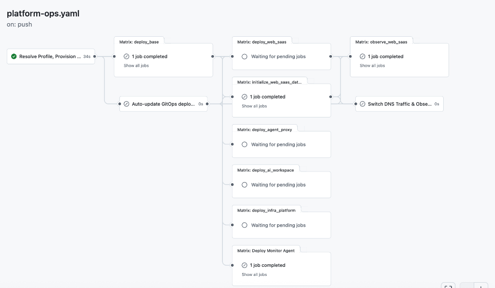
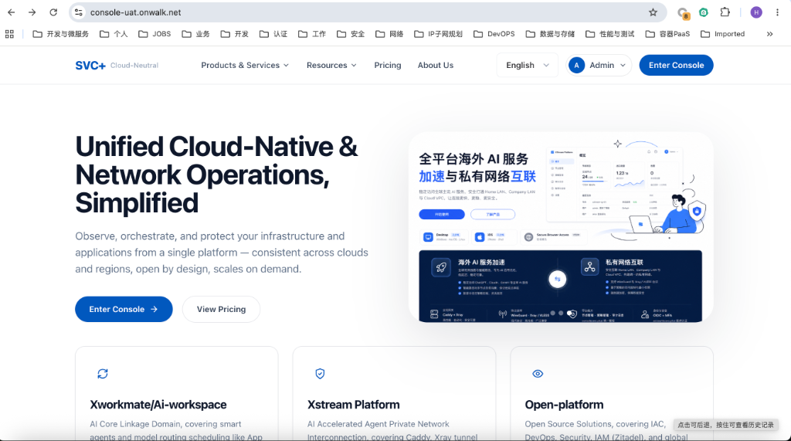
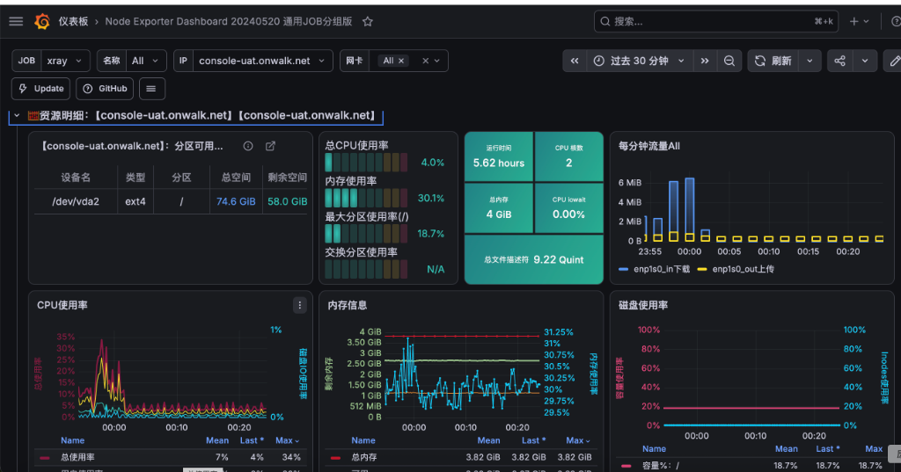
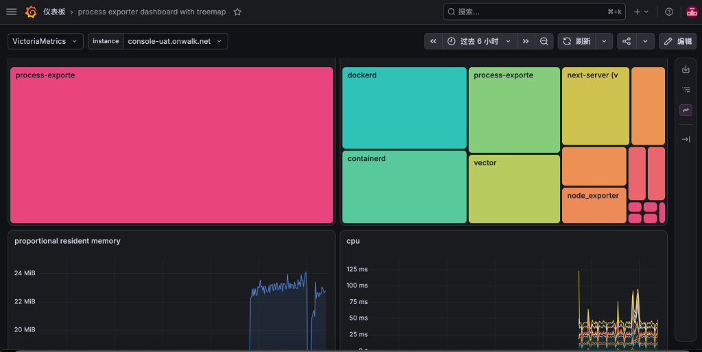
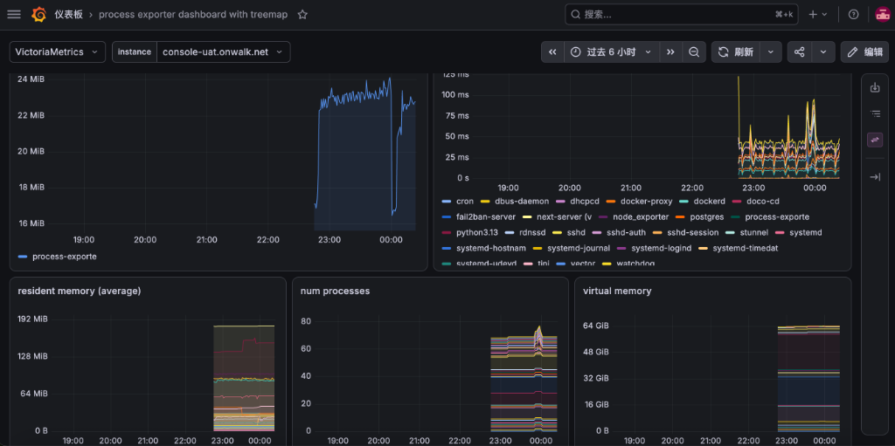

# 🚀 Elevating Multi-Cloud Delivery: Our Journey with Docker, GitOps, Vault, and GitHub Actions

As modern applications scale across multi-cloud architectures, managing secure and efficient deployments across multiple environments (UAT, Prod, etc.) becomes a massive challenge. Recently, our engineering team completely revamped our infrastructure delivery pipeline using **GitHub Actions**, **Docker**, **GitOps**, and **HashiCorp Vault**. 

Here’s a deep dive into the 4 core workflows that transformed our deployment lifecycle from fragile manual operations into a seamless, automated symphony. 🎵

---

## 🎯 Architectural Principles

Our goal was to eliminate "black-box" environments and manual toil by adhering to three core principles:
1. **Single Source of Truth**: Through GitOps, the exact version and state of any application running in any environment must be 100% declaratively represented in Git.
2. **Zero Trust & Centralized Secrets**: Moving away from static, long-lived tokens in favor of HashiCorp Vault and OIDC for dynamic, short-lived credential distribution.
3. **Immutable Infrastructure**: Leveraging Docker tags to ensure that the exact same artifact flows through every environment without modification.

---

## 🧠 Core Workflows Breakdown

### 1. `auto-gitops-tags-update`: The GitOps State Reconciler
> **The Problem**: Traditional CI pushes an image to a registry and fires an API call to a server. Git never knows what is actually running in production, making rollbacks a nightmare.

Here, we practice pure GitOps.
- **How it works**: When a new immutable image is built, the pipeline doesn't SSH into servers. Instead, it programmatically updates the infrastructure manifest repository with the new Docker Tag. 
- **The Value**: Every deployment is just a standard Git commit. You always know exactly what is running where, and rollbacks are as simple as `git revert`. State lives in Git; deployments rely on `Pull`.

### 2. `daily-main-snapshot.yaml`: The Immutable Baseline
> **The Problem**: Lack of periodic integration leads to stealthy conflicts and pre-release chaos.

- **How it works**: Running nightly, this workflow pulls from the main branch, runs full integration tests, and forcefully bakes `snapshot-YYYYMMDD` immutable Docker tags.
- **The Value**: It provides a rock-solid, verified baseline. Whether we are spinning up ephemeral load-testing environments or pushing to UAT, we rely on these exact snapshots. It ensures every cloud node pulls the exact same, gateway-approved artifact.

### 3. `cron-rotate-domain-tls-certs.yaml`: DevSecOps & Vault ACME Rotation
> **The Problem**: Managing HTTPS certificates across multi-cloud edge nodes manually is risky, error-prone, and a massive security blind spot.

This is where HashiCorp Vault truly shines in our architecture. We automated the entire lifecycle of our 90-day Let's Encrypt wildcard certificates:
- **JWT / OIDC Auth**: We eliminated plaintext Vault tokens. GitHub Actions authenticates against Vault using its native OIDC identity. Vault verifies the request (strictly limiting access to the `main` branch) and issues a short-lived token.
- **Automated Rotation & Secure Storage**: The pipeline provisions certificates via the Cloudflare DNS API inside an ephemeral container, then immediately uses `vault kv put` to inject the new certificates directly into our centralized Vault cluster.
- **The Value**: CI runners leave no trace and never touch production edge nodes. The edge gateways simply watch the Vault path and hot-reload the new certs seamlessly.

### 4. `platform-ops.yaml`: The Multi-Cloud Orchestrator
> **The Problem**: How do you orchestrate cross-cloud infrastructure provisioning, DNS traffic shifting, and component bootstrapping in sync?

This workflow acts as the master orchestrator and central bus of our delivery chain. 



- **How it works**: It doesn't compile business code. Instead, it chains infrastructure operations: analyzing upstream GitOps tags, bootstrapping observability agents, triggering database migrations, and executing weighted DNS traffic switches for Blue-Green deployments.
- **Security Gating**: We introduced rigorous CI gating. Custom verification scripts strictly prohibit un-audited inline shell scripts within the `run:` blocks to prevent supply chain poisoning.

### 5. All-in-One Delivery: From IaC to Full Observability
Via `platform-ops.yaml`, we don't just deploy applications; we bundle the entire **infrastructure monitoring lifecycle** into the same deployment workflow.



Whenever a new node joins or an environment initializes, the pipeline utilizes an Ansible Matrix to automatically bootstrap Node Exporter, Process Exporter, and logging agents.

````carousel

<!-- slide -->

<!-- slide -->

````

This isomorphic deployment strategy ensures that **wherever the business service runs, the monitoring mesh strictly follows**, completely eliminating monitoring blind spots caused by environment drift.

---

## 🔮 The Future Roadmap

Thanks to the highly modular design of `platform-ops.yaml`, our infrastructure is primed for advanced Site Reliability Engineering (SRE) capabilities:
1. **Seamless Multi-Cloud Migrations**: Utilizing cross-cloud orchestration combined with weighted DNS grey-releases to achieve zero-downtime hot migrations between cloud providers.
2. **Pre-release Automated Load Testing**: Integrating K6 or JMeter into the pipeline to run standard stress tests on dynamically provisioned ephemeral environments before production drops.
3. **Automated Disaster Recovery Drills**: Tapping into Vault’s active/standby replication to simulate cross-region failovers directly via GitHub Actions.
4. **Chaos Engineering**: Introducing Chaos Mesh or Gremlin to automatically inject faults (like network latency or pod crashes) into isolated zones during off-peak hours, validating our system's self-healing capabilities using our dense observability network.

---

## 💡 The Takeaway

## 🌐 Behind the Scenes: Our Open-Source Infrastructure Ecosystem

Achieving this level of seamless delivery is only possible because of our highly decoupled, multi-repo infrastructure architecture under the `ai-workspace-infra` organization. 

Instead of a monolith, we built an ecosystem of specialized, modular repositories:
- **[platform-ops-toolkit](https://github.com/ai-workspace-infra/platform-ops-toolkit)**: The AI-driven brain for migration and platform operations.
- The GitOps triad: **[gitops](https://github.com/ai-workspace-infra/gitops)** (State), **[playbooks](https://github.com/ai-workspace-infra/playbooks)** (Configuration), and **[iac_modules](https://github.com/ai-workspace-infra/iac_modules)** (Multi-cloud Provisioning).
- **[observability.svc.plus](https://github.com/ai-workspace-infra/observability.svc.plus)**: Our end-to-end observability stack integrating OpenTelemetry, Prometheus, and Loki.
- **[postgresql.svc.plus](https://github.com/ai-workspace-infra/postgresql.svc.plus)**: A production-ready PG cluster featuring vector search, secure TLS tunneling, and HA.
- Alongside supporting utilities like **artifacts** and **diagram-generator**.

This "Highly Cohesive, Loosely Coupled" multi-repo strategy allows our deployment pipelines to piece together IaC, foundational services, and business logic like LEGO blocks!

---

## 🤖 AI Empowerment: An Exponential Leap in Engineering Velocity

Traditionally, architecting, scripting, and debugging an infrastructure ecosystem spanning **10+ repositories with Ansible, Terraform, GitHub Actions, Vault, TLS, and OpenTelemetry** would demand at least **2 to 3 months** of full-time effort from a senior DevOps engineer.

However, in this refactoring phase, by deeply pair-programming with **Agentic AI**:
- Architecture deduction and IaC modularization
- Tackling pipeline blockers (e.g., automated TLS rotation & Vault Zero-Trust auth)
- Writing and debugging complex bash/python supply-chain gating scripts

**The entire milestone was achieved in merely a few weeks, with some complex components built in just days!** The AI Agent didn't just handle tedious YAML syntax; when faced with obscure CI/CD errors (like cross-cloud OIDC claim rejections or permission scoping), it demonstrated a remarkable ability to autonomously analyze logs, trace the execution path, and provide PR-ready solutions.

By combining **Docker (Execution)** + **GitOps (State)** + **Vault (Security)** + **GitHub Actions (Orchestration)** + **AI Agents (The Engineering Brain)**, we successfully migrated away from the fragility of manual operations. 

We’re no longer storing sensitive configurations in scattered GitHub Secrets, but centralizing them in Vault with granular, short-lived OIDC access. 

How is your team handling multi-cloud secrets, deployment orchestration, and leveraging AI in platform engineering? Let’s discuss in the comments! 👇

#DevSecOps #GitOps #Docker #Vault #GitHubActions #MultiCloud #PlatformEngineering #AgenticAI #SRE
