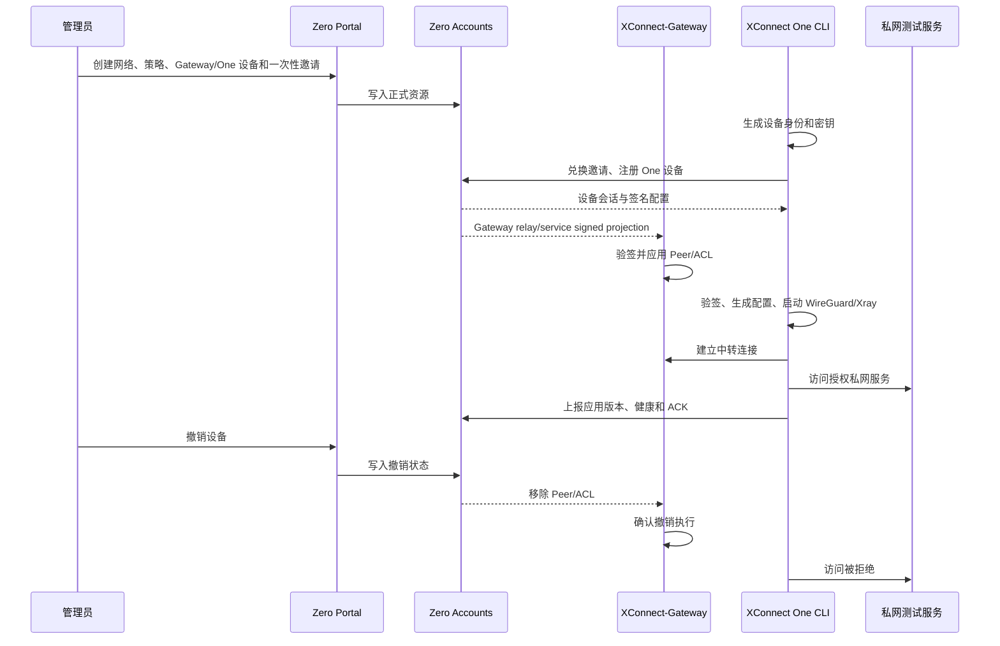

# XConnect Zero / Gateway / One 首期闭环规划与实施记录

更新时间：2026-09-07  
状态：首期代码与云端联调流水线已建立；真实 AWS Spot apply 当前被 live Vault JWT role 白名单阻塞。

## 1. 首期目标

首期目标是跑通一个正式 XConnect Zero、一个 XConnect-Gateway，以及至少两台 Linux XConnect One 受控端：

```text
XConnect Zero
├── accounts：正式 API、设备、网络、策略、签名配置
└── portal：Zero 管理 WebUI

XConnect-Gateway
└── 独立 Linux relay/service：中转、WireGuard/Xray、策略执行

XConnect One
└── 独立 Linux controlled-client CLI：
    sync → 生成配置 → 启动 WireGuard/Xray → 加入私网
```

最终目标不是让 `xconnect-app` 承载 CLI，而是让 One CLI 与 `xconnect-app` 保持产品和代码独立，通过可选插件扩展组合。

首期必须先证明真实的加入、连接、续期、撤销与业务可达性，再扩展桌面端和移动端。

## 2. 产品边界

### XConnect Zero

Zero 是唯一的集中控面和配置来源，由两部分组成：

- `accounts`：正式持久化 API，管理组织、网络、设备、邀请、地址租约、设备会话、策略、签名配置和审计。
- `portal`：Zero 管理 WebUI，管理员通过它管理 Gateway、One 设备、网络、策略和签名配置。

Zero 负责“谁能加入、拿到什么配置、拥有什么权限”；不负责替代节点上的 WireGuard/Xray 运行时。

### XConnect-Gateway

Gateway 是独立的 Linux 服务节点，角色为 `relay/service`，部署在自建 VPS 或 EC2 上：

- 运行外部 WireGuard 和 Xray 进程。
- 作为 One 与私有网络/服务之间的中转节点。
- 应用 Zero 下发的 Gateway relay/service 投影、Peer 和 ACL。
- 负责转发、策略执行、健康上报和撤销后的访问阻断。
- 不使用 Cloud Run、Cloudflare Workers 或其他 serverless/edge function 承载网络数据面。

### XConnect One

One 是独立的 Linux 受控端产品，角色为 `controlled-client`：

- 独立安装、构建、版本化和发布。
- 不要求安装或启动 `xconnect-app`。
- 从 Zero 获取邀请、设备凭据和签名配置。
- 本地生成/验证配置，启动外部 WireGuard/Xray，并加入 Zero Trust 私网。
- 管理本机设备身份、会话、连接生命周期、续期、撤销响应和诊断。

首期命令基线：

```text
xconnect join <invite>
xconnect status --json
xconnect sync
xconnect diagnose
xconnect credential rotate
xconnect leave
```

### XConnect App

`xconnect-app` 保持独立：

- 继续维护已有图形客户端、连接能力、平台宿主和插件管理。
- 不复制 One 的 Join/session 状态机。
- 不直接依赖 CLI 内部代码、内部数据库或明文凭据。
- 通过版本化插件接口可选接入 One。
- 未启用 One 插件时，App 现有功能必须照常工作。

组合关系：

```text
XConnect Zero
      ↑ 控面 API
XConnect One Core
      ├── One CLI：独立使用
      └── One 插件适配器：可接入 xconnect-app
                              └── UI / 平台宿主能力
```

插件接口首期只暴露加入、退出、同步、状态和诊断；App 不应把安装 CLI 当作隐含依赖。

## 3. 配置流和状态模型

Gateway 与 One 的配置都来自 Zero；两者只消费不同角色的投影：

```text
管理员
  ↓
portal
  ↓
accounts（唯一事实来源）
  ├── Gateway relay/service signed projection
  └── One controlled-client signed config
```

实验 `xconnect-zero-lab` 只用于一次性云端联合调试和 API/runtime 契约验证，不是正式 Accounts API、Portal 或生产配置源。

必须区分以下三个状态：

1. `registered`：设备已注册并持有有效身份。
2. `config_applied`：签名配置已验证并成功应用到本机运行时。
3. `reachable`：通过真实 WireGuard/Xray 私网路径访问授权服务成功。

设备加入不应产生 Git 提交，也不应触发 Ansible；GitOps 管环境，Zero 数据库管运行状态。

## 4. 首期闭环时序



## 5. 仓库职责分配

| 仓库 | 首期职责 | 主要交付 |
|---|---|---|
| `ai-workspace-xstream/accounts` | XConnect Zero 正式控面 | 网络、设备、邀请、地址租约、设备 session、策略、签名配置、Gateway 投影、ACK、审计 |
| `ai-workspace-xstream/portal` | Zero 管理 WebUI | `/panel/xconnect-zero`、Gateway/One 管理、网络/策略/签名配置入口、权限和空状态处理 |
| `ai-workspace-xstream/XConnect-One` | 独立 One 产品 | CLI、设备身份、Join/session、配置验签、策略消费、Linux WireGuard/Xray 运行时、安装升级 |
| `ai-workspace-xstream/xconnect-app` | 独立图形客户端 | 既有连接能力、插件管理、平台宿主、One 插件适配，不承载 One 核心业务逻辑 |
| `ai-workspace-infra/iac_modules` | 可复用基础设施 | VPC、Spot EC2、网络约束、参数校验、Gateway/One 资源和输出 |
| `ai-workspace-infra/playbooks` | 主机系统交付 | WireGuard/Xray/Agent 安装、systemd、权限、转发、防火墙、升级和验收 |
| `ai-workspace-infra/gitops` | 环境期望状态 | Zero/Gateway/One 拓扑、固定版本、网络范围、域名和 secret 引用 |
| `ai-workspace-infra/platform-ops-toolkit` | 跨仓编排与验证 | 固定 SHA、OIDC/Vault、构建、Terraform、SSH bootstrap、真实流量验证和清理 |

边界原则：

- GitOps 管“部署什么、用哪个版本、允许哪些网络范围”。
- Zero 数据库管“谁加入、设备公钥、地址、会话、策略和撤销”。
- Gateway 执行动态网络策略并回报实际应用状态。
- One CLI 管本机密钥、配置、进程生命周期和诊断。
- IaC 不保存设备实时注册状态，也不保存 secret。

## 6. Zero 正式 API

API 优先兼容已有 `/api/overlay/v1` 客户端协议，品牌名称改为 XConnect Zero 不改变已使用的技术路径。

当前契约覆盖：

```text
POST /api/overlay/v1/join-tokens/exchange
POST /api/overlay/v1/device/session
GET  /api/overlay/v1/enrollment/signed-config
POST /api/overlay/v1/enrollment/signed-config/{generation}/ack
POST /api/overlay/v1/device/credential/rotate
POST /api/overlay/v1/device/revoke
GET  /api/overlay/v1/signing-keys
GET  /api/overlay/v1/signed-config
GET  /api/overlay/v1/gateway/signed-config
```

核心对象：

| 对象 | 首期行为 |
|---|---|
| `Network` | 地址池、组织归属、默认拒绝策略、Gateway 绑定 |
| `Invite` | 有效期、使用次数、网络/角色限制、并发兑换只能成功一次 |
| `Device` | 稳定 ID、公钥、平台、角色、状态、凭据版本 |
| `AddressLease` | 事务分配、唯一约束、撤销后的回收规则 |
| `DeviceSession` | 持久凭据换短期会话，限定设备/网络/权限 |
| `Policy` | 默认拒绝；首期授权目标网段、协议和端口 |
| `Config/Snapshot` | 签名、generation、有效期、设备/节点绑定、应用回执 |
| `Audit` | 邀请、注册、策略修改、轮换、撤销和失败事件 |

必须冻结的契约细节：签名字节规范、generation 语义、错误码、幂等键、轮换窗口、撤销传播、ACK 含义和控面失联后的旧配置有效期。

## 7. Gateway 与 One 运行基线

两者使用同一套独立 Linux 运行原则：

- 外部 WireGuard 进程，不把内核嵌入 CLI 或 Portal。
- 外部 Xray 进程，配置由 Zero 签名配置驱动。
- systemd 托管、启动失败自动恢复、配置文件权限收紧。
- 运行状态与 ACK 回到 Zero。
- 所有密钥只存在于 Vault、受保护的运行时文件或设备安全存储。

角色差异：

| 维度 | Gateway | One |
|---|---|---|
| Zero 角色 | `relay/service` | `controlled-client` |
| 方向 | 中转和服务节点 | 受控客户端 |
| 运行 | WireGuard/Xray、转发、ACL、私网服务探针 | WireGuard/Xray、CLI 生命周期、私网接入 |
| 配置投影 | Peer/ACL/relay/service | 设备配置/策略/客户端 endpoint |
| 部署 | 自建 VPS 或 EC2 | Linux 受控主机，首期 AWS Spot lab |
| 公网 UDP | 默认关闭 | 不需要公开监听 |

## 8. 云端联调拓扑

默认 SIT disposable lab：

```text
AWS ap-northeast-1
└── disposable VPC 10.78.0.0/24
    ├── XConnect-Gateway：AWS one-time Spot EC2，role=relay
    │   ├── external WireGuard
    │   ├── external Xray TLS 443
    │   ├── temporary lab controller 8443（仅调试）
    │   └── private probe 10.77.0.1:8080
    └── XConnect-One：AWS one-time Spot EC2，role=controlled-client
```

默认策略：

- Gateway 和 One 都使用 AWS Spot EC2。
- Gateway 与 One 位于同一临时 VPC，优先走私网传输。
- SSH 仅允许 GitHub runner 当前 `/32`。
- Gateway TLS/API 只允许受控客户端安全组访问。
- 公网 WireGuard UDP `51820` 默认关闭。
- Gateway 不部署到 Cloud Run 或 Cloudflare Workers。
- Vultr 只作为显式 `gateway_provider=vultr` 可选路径，不是默认路径。

## 9. Vault 与身份认证

GitHub Actions 使用 GitHub OIDC JWT 登录 Vault，目标 role：

```text
github-actions-platform-ops-toolkit-sit
```

固定路径：

| 用途 | Vault KV v2 API path |
|---|---|
| CI/基础设施 | `kv/data/CICD/sit` |
| XConnect-One SIT runtime | `kv/data/sit/xconnect-one` |
| XConnect-One UAT runtime | `kv/data/uat/xconnect-one` |
| XConnect-One PROD runtime | `kv/data/prod/xconnect-one` |
| GitHub App | `kv/data/CICD/github-app/daily-snapshot` |

SIT runtime 字段：

```text
ADMIN_TOKEN
SIGNING_KEY
VLESS_ID
```

要求：

- secret 不进入 Git、Terraform tfvars、Actions artifact、普通日志或诊断输出。
- 只有 GitHub OIDC 短期身份和 Vault JWT role 可取 secret。
- `VULTR_API_KEY` 只在显式 Vultr 后端路径读取。
- Vault role 的 `job_workflow_ref` 必须精确允许 `xconnect-cloud-lab.yml`。
- workflow 不自行修改 Vault role，也不以静态密钥绕过 JWT。

## 10. 流水线执行模型

`platform-ops-toolkit/.github/workflows/xconnect-cloud-lab.yml` 的阶段：

1. 校验四个仓库的完整 immutable SHA。
2. 用 GitHub OIDC JWT 登录 Vault。
3. 通过 GitHub App 只读拉取 IaC、GitOps、XConnect-One 和 Xray 源码。
4. 编译真实 XConnect-One CLI、实验 lab controller 和外部 Xray。
5. 解析 GitOps SIT 拓扑。
6. 获取 AWS 短期 OIDC credentials。
7. Terraform 创建独立 VPC、网络、Spot Gateway 和 Spot One。
8. 通过 SSH bootstrap 两台 Linux 主机。
9. 生成一次性 CA 和临时运行配置。
10. 执行 Gateway/One 真实加入和数据面验证。
11. 任何成功、失败或中断都触发只针对本次 run 的 cleanup。
12. 定时 reaper 清理 runner 丢失后的过期 lease。

流水线不使用 Terraform provisioner，不把主机长期纳入生产环境。

## 11. 首期真实验收标准

必须保存可核验的端到端证据，而不是只看本地 readiness：

### Gateway

- `/etc/xconnect-lab/node-role` 为 `relay`。
- `wg-quick@wg0` active。
- 外部 Xray service active，TLS `443` 监听。
- 实验 Zero API TLS health 返回预期认证状态。
- Gateway 能看到 One peer 的最近 WireGuard handshake。
- Gateway 路由包含 `10.77.0.2/32 dev wg0`。

### One CLI

- `/etc/xconnect-lab/node-role` 为 `controlled-client`。
- `join` 只消费一次性邀请，重复兑换不重复注册。
- `sync` 能验签并生成配置。
- 外部 WireGuard/Xray 已启动。
- `status`、`diagnose` 能反映真实进程、socket 和隧道状态。
- One 能看到最近 handshake。

### 真实私网流量

- One 能 ping `10.77.0.1`。
- One 能访问 Gateway 私网 HTTP `10.77.0.1:8080`，响应包含本次 run 标识。
- 关闭 One tunnel 后同一 HTTP 请求必须失败。
- 未授权端口和网段必须被 Gateway 默认拒绝。
- 撤销 One 后 Gateway 在目标时限内移除 Peer/ACL，客户端即使不配合也不可达。
- 建议首期撤销传播目标为 60 秒以内。

### 持久化和恢复

- Zero 重启不丢设备、地址、邀请消耗和策略。
- One 重启或中途退出后可以恢复 session。
- 错误签名、旧 generation、过期配置不会应用。
- Gateway 更新失败保留可验证的旧配置并上报失败。
- 凭据轮换响应丢失时可以安全重试。

## 12. 分阶段实施路线

| 阶段 | 负责仓库 | 退出条件 |
|---|---|---|
| P0 恢复与对齐 | accounts、XConnect-One、xconnect-app、iac_modules | 确认旧成果、冻结角色/API/签名 fixture |
| P1 Zero 最小控面 | accounts、portal | 网络、邀请、注册、签名配置、ACK 持久化完成 |
| P1 One 独立闭环 | XConnect-One | Linux 独立 join/sync/up/down/renew/revoke 可恢复 |
| P2 Gateway 动态闭环 | accounts、playbooks、Gateway runtime | Peer/ACL 投影、验签、旧配置回滚、状态上报完成 |
| P2 测试环境 | gitops、iac_modules、platform-ops-toolkit | 固定版本、Vault、AWS Spot disposable lab 可重复创建 |
| P3 策略与撤销 | 全部相关仓库 | 真实允许/拒绝/撤销证据达标 |
| P4 发布与运维 | accounts、XConnect-One、platform-ops-toolkit | 安装包、备份恢复、升级回滚、监控与诊断文档 |
| P5 App 插件 | xconnect-app、XConnect-One | 版本化插件接口和兼容矩阵完成，不阻塞 CLI 首期 |

P0 完成后，Zero、One 和 Gateway 可以并行；最终合流点是实际加入、访问和撤销测试。

## 13. 已完成实现与提交

### XConnect-One

独立仓库已建立，包含：

- 独立 Go CLI 和 `overlay` 核心。
- `sync`、签名配置、WireGuard/Xray 外部运行时。
- 实验 Zero lab controller。
- 可选 APP bridge JSON Lines 协议，APP 不导入 One 业务域。
- Linux amd64/arm64 构建、Go test、vet 和 race 验证。

### accounts

[PR #2](https://github.com/ai-workspace-xstream/accounts/pull/2) 已合并：

- `internal/overlay` Zero domain/service/repository。
- GORM + PostgreSQL/SQLite 测试迁移。
- One invite/session/signed-config/policy/ACK API。
- Gateway `role=gateway` 和 Gateway signed-config API。
- One `role=one` 严格 JSON 兼容。
- Ed25519 集中签名，邀请 token 只保存 hash。

### portal

[PR #1](https://github.com/ai-workspace-xstream/portal/pull/1) 已合并：

- 默认关闭、受保护的 `/panel/xconnect-zero`。
- Zero 设备、网络、策略、签名配置管理入口。
- 明确 accounts 是唯一集中控面。
- 不展示假数据、设备凭据、私钥或签名配置明文。

### 基础设施和流水线

以下 PR 均已合并：

- [iac_modules #270](https://github.com/ai-workspace-infra/iac_modules/pull/270)：AWS Spot Gateway/One、临时网络、角色输出和可选 Vultr。
- [gitops #189](https://github.com/ai-workspace-infra/gitops/pull/189)：Zero 来源、Gateway/One 角色、AWS Spot 默认拓扑。
- [platform-ops-toolkit #570](https://github.com/ai-workspace-infra/platform-ops-toolkit/pull/570)：云端联调流水线和验收脚本。
- [platform-ops-toolkit #571](https://github.com/ai-workspace-infra/platform-ops-toolkit/pull/571)：Vault workflow allowlist 修复。

相关低优先级维护项已记录在 [xconnect-app issue #75](https://github.com/ai-workspace-xstream/xconnect-app/issues/75)。

## 14. 当前真实执行状态

已尝试从 `main` 运行真实 AWS apply：

- [Run 34108361076](https://github.com/ai-workspace-infra/platform-ops-toolkit/actions/runs/34108361076)
- [Run 34108471362](https://github.com/ai-workspace-infra/platform-ops-toolkit/actions/runs/34108471362)
- [Run 34110178990](https://github.com/ai-workspace-infra/platform-ops-toolkit/actions/runs/34110178990)
- [Run 34110239295](https://github.com/ai-workspace-infra/platform-ops-toolkit/actions/runs/34110239295)，attempt 1–4

所有运行都在 Vault JWT 认证阶段停止，错误为：

```text
claim "job_workflow_ref" does not match any associated bound claim values
```

所以截至本文件更新时间：

- 没有进入 AWS OIDC。
- 没有进入 Terraform apply。
- 没有创建 Gateway 或 One Spot 实例。
- 没有执行真实私网加入、同步、WireGuard/Xray、ping/HTTP 或 handshake 验证。
- 没有产生需要清理的 AWS 资源。

代码侧已经把验证流程准备好；剩余阻塞是 live Vault role 的实际配置必须包含：

```text
ai-workspace-infra/platform-ops-toolkit/.github/workflows/xconnect-cloud-lab.yml@*
```

## 15. 下一步操作清单

1. 在与 GitHub Actions 相同的 Vault 地址和 JWT mount 上读取 SIT role，确认 `job_workflow_ref` 含 `xconnect-cloud-lab.yml@*`。
2. 若缺失，从合并后的 `platform-ops-toolkit/main` 执行 `scripts/create_vault_service_repo_roles.sh`。
3. 确认 `kv/data/CICD/sit` 的 Terraform backend 字段存在。
4. 确认 `kv/data/sit/xconnect-one` 的 `ADMIN_TOKEN`、`SIGNING_KEY`、`VLESS_ID` 存在且格式正确。
5. 确认 GitHub App 对 `iac_modules`、`gitops` 和私有 `XConnect-One` 具备 Contents read。
6. 确认 AWS role `GithubAction_IAC_Deploy_Role` 具备 SSM AMI 查询、VPC/SG/key pair/Spot EC2 创建删除权限。
7. 重新运行 `XConnect Cloud Lab` 的 `apply`。
8. 保存 Gateway/One 角色、加入、签名配置、握手、私网流量和 tunnel-down 证据。
9. 无论结果如何确认 cleanup 完成，并检查本次专用 Terraform state 为空。

## 16. 运维和安全约束

- 真实设备状态不写入 GitOps。
- 不在日志中打印 token、私钥、Vault response body 或完整配置。
- 不把 Vault、GitHub、AWS 凭据复制到 Gateway/One 主机。
- 不使用未经审核的 branch SHA、latest 镜像或未固定的 Xray 版本。
- Spot 中断应视作预期故障；实验环境必须可重建，不能依赖单次实例存活。
- Gateway 和 One 的配置应用必须幂等，更新失败必须能回滚旧配置。
- 控面失联时旧配置保留时间必须与撤销时限、配置有效期一起定义，禁止无限期保留权限。
- 生产 Gateway 继续使用 VPS/EC2 长驻服务节点；实验 Spot 只用于 disposable cloud validation。

## 17. 历史分支与恢复记录

最初排查的本地仓库为：

```text
/Users/shenlan/workspaces/ai-workspace-xstream/xconnect-app
```

只读检查得到的结论：

- GitHub 远程的 XConnect One 相关开发分支仍然存在，没有发现整套远程成果丢失。
- 本地仓库存在未提交修改，涉及 Makefile、iOS/macOS 文件和 Android `jniLibs`；这些修改属于用户工作，不应覆盖、清理或重置。
- 没有发现可直接用于恢复的 stash。
- 本地分支引用总体都能对应 `origin`；需要重点区分“已经 push 的分支成果”和“未 push 的本地工作树”。

重点远程分支：

```text
codex/xconnect-overlay-productization
codex/xconnect-batch-00-docs
codex/xconnect-batch-01-product-plugin
codex/xconnect-batch-02-cli-join
codex/xconnect-batch-03-desktop-runtime
codex/xconnect-batch-04-invite-join
codex/xconnect-batch-04-signed-config-client
codex/xconnect-batch-05-mobile-enrollment
codex/xconnect-batch-06-cli-lifecycle-policy
codex/xconnect-batch-07-device-session
codex/xconnect-batch-08-signed-config-v2
```

可复用能力对应关系：

| 分支 | 可恢复能力 |
|---|---|
| batch-00 | 设计和实施文档 |
| batch-01 | 产品插件方向 |
| batch-02 | 可恢复 CLI Join |
| batch-03 | Desktop runtime |
| batch-04 | 一次性邀请、签名配置客户端 |
| batch-05 | Mobile enrollment |
| batch-06 | CLI 生命周期和策略接口 |
| batch-07 | 持久设备凭据、session、轮换、退出 |
| batch-08 | 签名配置 v2 和策略绑定 |

这些分支存在堆叠关系，不能当作互相独立的完整功能逐条重复合并。尤其 batch-07 的后续文档提交不一定都包含在 batch-08 中；迁移时应保留来源提交记录和测试。

当前恢复策略是：

1. 将 One 业务核心从 `xconnect-app` 独立迁移到 `XConnect-One`，保留来源提交和测试依据。
2. 让 One CLI 作为独立产品先完成 Linux 闭环。
3. 让 `xconnect-app` 继续独立维护，通过版本化插件接口组合 One。
4. 将历史分支保留为低优先级维护事项，不直接删除或重写。

该事项已记录在 [xconnect-app issue #75](https://github.com/ai-workspace-xstream/xconnect-app/issues/75)。
